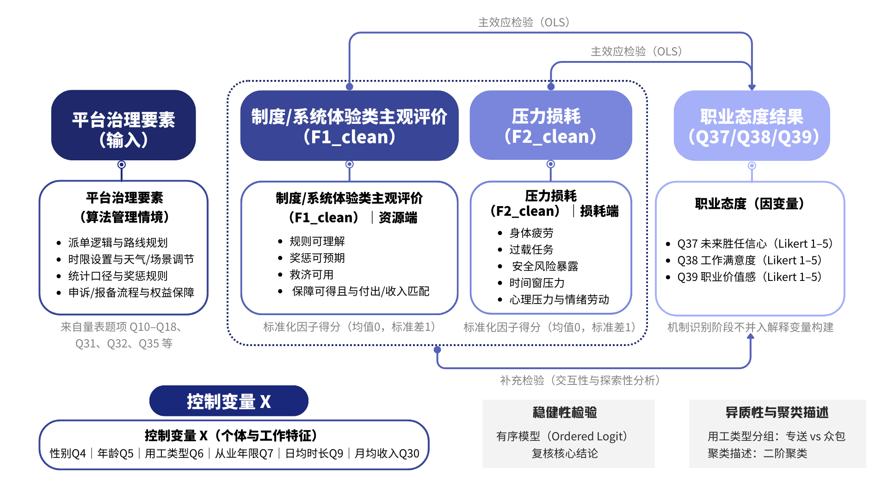
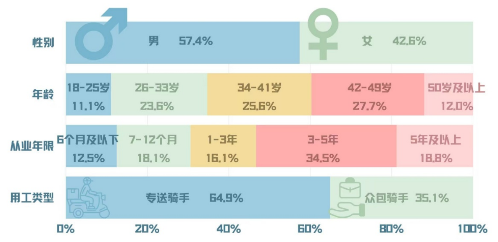
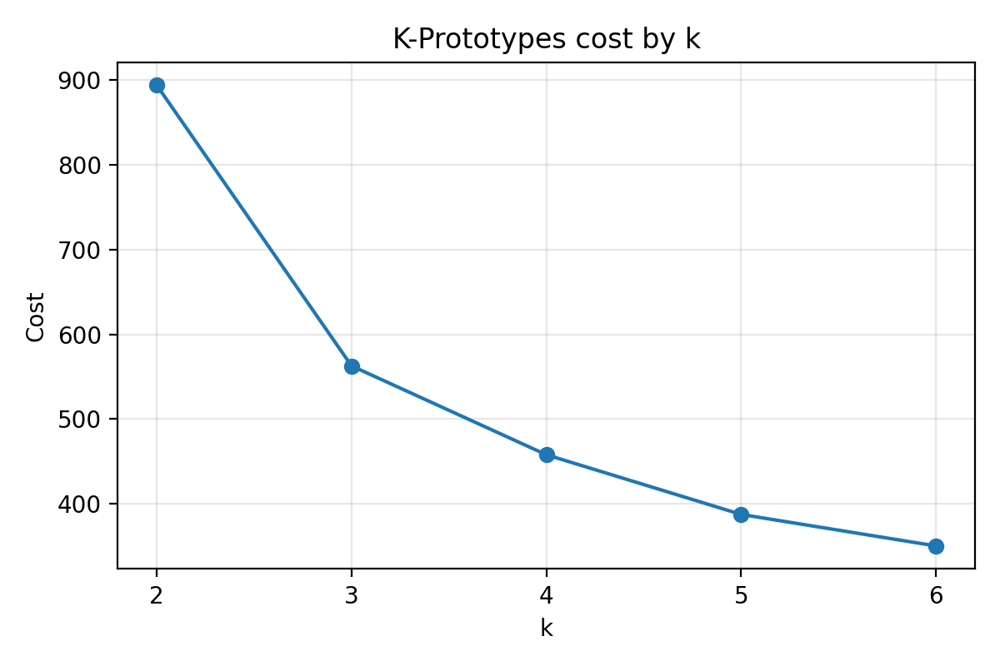
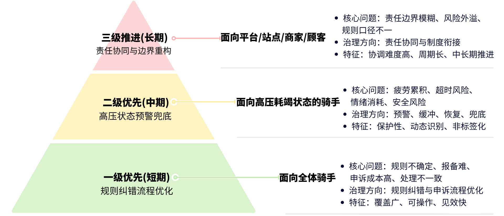

# 算法管理下外卖骑手职业态度差异研究

> **方向**：用户研究 · 市场研究 · 社会调查 · 量化分析

## 30 秒了解

| 项目 | 内容 |
| --- | --- |
| 研究问题 | 平台算法管理、系统体验和工作压力如何影响骑手职业态度 |
| 我的工作 | 问卷框架、因子构建、骑手画像、回归、交互效应和异质性分析 |
| 技术 | `Python` `Jupyter` `Factor Analysis` `K-means` `OLS` `Interaction Effect` |
| 结果 | 交互模型 `N=542`，主要模型 `R²=0.380–0.450` |
| 证据 | 分析 Notebook、回归表、聚类图、边际效应图、研究框架图 |

## 关键发现

- `F1` 系统/平台体验因子在主要模型中呈正向关联，系数约为 `0.69–0.74`。
- 基于标准化因子得分完成骑手群体画像，为差异化治理建议提供依据。
- 通过交互检验和异质性分析识别不同群体、不同条件下的关系差异。

## 图表速览

### 研究框架



### 样本结构与聚类选择





### 治理方案



## 代码与结果

```text
analysis/notebooks/          # 因子分析与骑手聚类
analysis/results/            # 回归表、聚类图、研究框架图和治理方案图
analysis/README.md           # 变量、方法和复现边界
```

运行 Notebook 前，将经过授权和脱敏的本地数据命名为 `clean.xlsx`，详细说明见 [`analysis/README.md`](analysis/README.md)。

## 隐私边界

不包含原始问卷、受访者级数据、队员名单、报名表、承诺书、论文成稿或参考文献 PDF，仅保留方法、聚合结果和图表。
